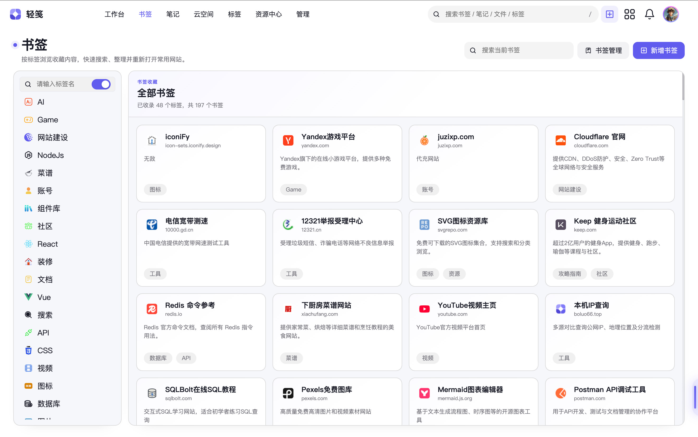
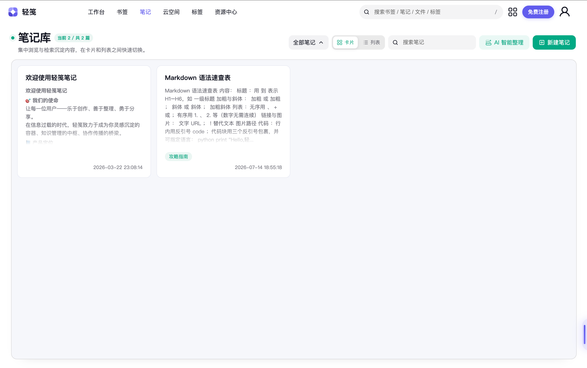
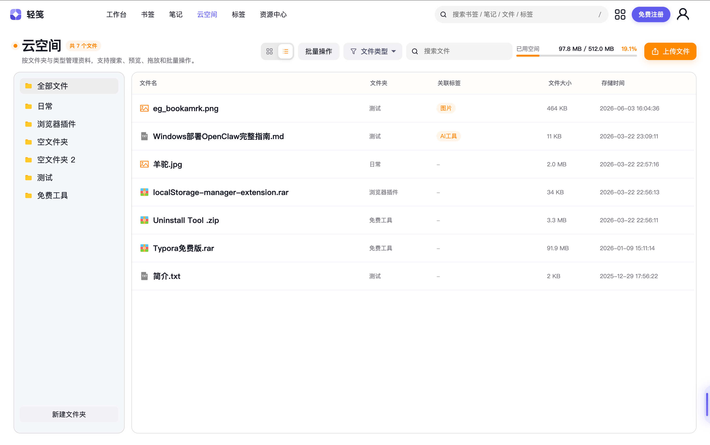
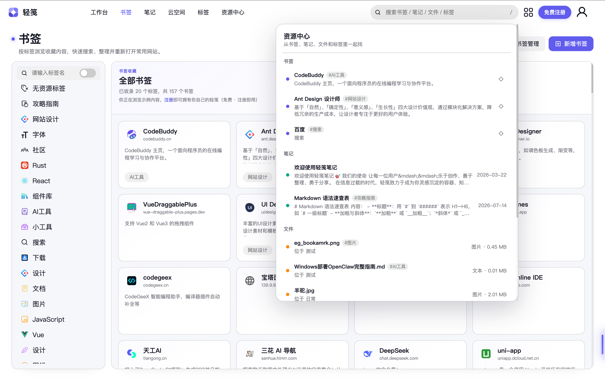
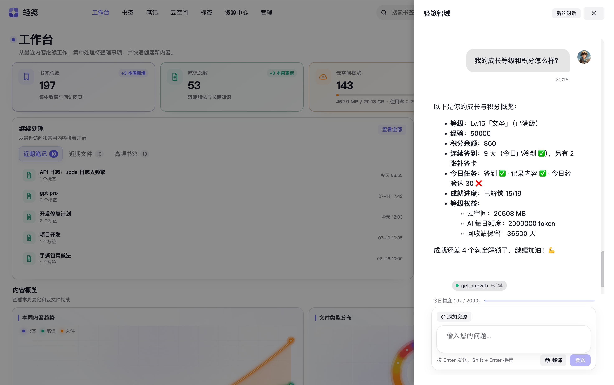

  
  
  
  

<h1 align="center">📦 轻笺 · LightNote</h1>

  <b>A free online workspace for bookmarks, notes, and cloud files</b>
   
  Bookmarks · Notes · Cloud files · AI assistant · Cross-device sync
   
  免费的书签、笔记与云文件管理平台

  

  
  
  
  

---

### Sound familiar?

❝ Find a great article → save it to browser bookmarks → **never open it again** ❞  
❝ Quick notes scattered across Apple Notes, Notion, local txt → **can't find any of them** ❞  
❝ Work files arriving over chat, shuffled through cloud drives → **endless back-and-forth** ❞  

**LightNote puts them all in one place.** Bookmarks auto-fetched, notes jotted on the fly, files stored in the cloud — all tied together by unified tags.  
Open it in your browser and get started. The hosted service is currently **free to use**, with no deployment required.

  <a href="https://boluo66.top"><b>👉 Give it a try → boluo66.top</b></a>

---

## Features at a glance

**📌 Bookmark management**  
Paste a link and the title, description, and icon are fetched automatically. Tag tree on the left, card wall on the right, multi-tag filtering.

  

---

**📝 Note library**  
Rich text | Markdown dual-mode editing with instant switching. Supports text, images, tables, and code blocks, plus multi-level folders, card/list dual views, PDF export, and mobile editing.

  

---

**☁️ Cloud space**

Keep files organized by folder and type, with upload, search, online preview, drag-and-drop organization, bulk actions, and unified tags. Storage usage stays visible, and frequently used files remain available across devices.

  

---

**🔍 Global search**  
Search bookmarks, notes, tags, and files across every module at once — keyword + tag filtering, found in seconds.

  

---

**🤖 AI assistant**  
Built-in conversational AI that can call tools to look up your bookmarks, notes, and growth data — with web search, deep thinking, and streaming responses.

  

---

**💡 [Co-build LightNote](https://boluo66.top/co-build)**

See user suggestions, developer replies, and real progress in public. Follow what is planned, in development, or already shipped — then sign in to submit ideas and vote.

  

---

**And more** 🌱 Growth system (check-in / points / achievements) · 📚 Knowledge base · 🕸️ Relationship graph · 🔗 Note sharing · 🌙 Dark / light theme · 📱 Mobile-friendly · 🌐 Bilingual (中 / EN) · 🗑️ Recycle bin · 🏷️ Unified tags · 🛡️ Security center

---

## How it compares

| Aspect | LightNote | Notion | Cubox | Raindrop |
|------|------|--------|-------|----------|
| Bookmarks | ✅ tags + search | ❌ too heavy | ✅ | ✅ |
| Note writing | ✅ rich text + Markdown | ✅ | ❌ | ❌ |
| File storage | ✅ cloud + preview | ❌ paid | ❌ | ❌ |
| Unified tags | ✅ **cross-type** | ⚠️ per module | ✅ | ❌ |
| Hosted plan | 🆓 **free to use** | 💰 $10/mo | 💰 ¥10/mo | 💰 $3+/mo |
| Feel | ⚡ **light & fast** | ❌ slow | ✅ fast | ✅ fast |

**Not as heavy as the big platforms, not as limited as the single-purpose tools.**

---

## ⚡ Get started

1. Open **[boluo66.top](https://boluo66.top)**
2. Sign up (30 seconds)
3. Start organizing your digital odds and ends

Desktop + mobile, with cloud sync — it follows you wherever you go.

  
  

---

## 🛠️ Tech stack

Frontend · Vue 3 · TypeScript · Pinia · Vite · TinyMCE · AntV  
Backend · Node.js · Express · MySQL  
Deployment · Huawei Cloud · Nginx · PM2 · OBS object storage

---

## 💻 Source code and development

LightNote is first and foremost an online service for end users. Its source code is also available here for transparency, issue reporting, and community contributions.

- **Want to use LightNote?** Visit **[boluo66.top](https://boluo66.top)** — no server or environment setup required.
- **Want to contribute?** Read the **[contribution guide](CONTRIBUTING.md)** and **[development guide](docs/development.md)**.
- **Want to deploy it yourself?** A production installation depends on a database, object storage, cache, email, and third-party AI services. A one-click, beginner-oriented self-hosting setup is not currently provided.

The source code is available under the [MIT License](LICENSE). Storage, AI features, and usage quotas of the hosted service are subject to the information shown in the product.

---

  
    
  Like it? → ⭐ <b>Star</b> to show your support
   
  Got ideas? → open an <a href="https://github.com/VeteranBoLuo/light-note/issues">Issue</a> or read the <a href="CONTRIBUTING.md">contribution guide</a>
   
  Every Star fuels another late-night coding session ✨

