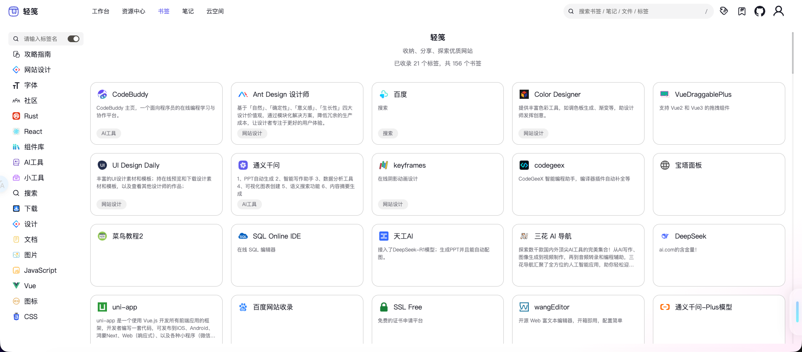
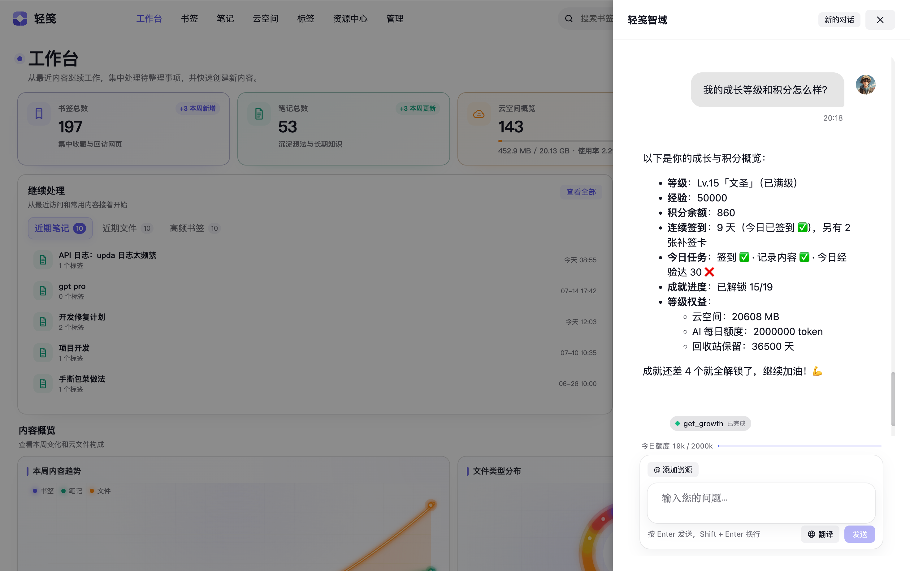
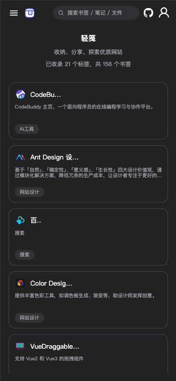

  
  
  
  

<h1 align="center">📦 轻笺 · LightNote</h1>

  <b>あなたのデジタルライフ整理箱 — Notion より速く、Cubox より軽い</b>
   
  ブックマーク · ノート · クラウドファイル · AI アシスタント

  

  
  
  
  

---

### こんなこと、毎日起きていませんか？

❝ 良い記事を見つけた → ブラウザのお気に入りに保存 → **二度と開かない** ❞  
❝ メモがメモアプリ・Notion・ローカル txt に散らばって → **見つからない** ❞  
❝ 仕事のファイルがチャットで届き、クラウドを行き来 → **あちこち移動ばかり** ❞  

**LightNote はそれらを一箇所にまとめます。** ブックマークは自動取得、メモは手軽に記録、ファイルはクラウド保存。統一タグですべてを串刺しに。  
ブラウザを開けばすぐ使える、**無料・デプロイ不要**。

  <a href="https://boluo66.top"><b>👉 試してみる → boluo66.top</b></a>

---

## 機能ひとめ

**📌 ブックマーク管理**  
リンクを貼るだけでタイトル・説明・アイコンを自動取得。左にタグツリー、右にカードウォール、複数タグでの絞り込み。

  

---

**📝 ノートライブラリ**  
リッチテキスト編集。文章・画像・表・コードブロックに対応。多階層フォルダ、カード / リストの 2 ビュー、PDF 書き出し。モバイルでも記録可能。

  

---

**🔍 グローバル検索**  
ブックマーク・ノート・タグ・ファイルをまとめて横断検索。キーワード + タグの絞り込みで数秒で発見。

  

---

**🤖 AI アシスタント**  
対話型 AI を内蔵し、知識の処理を支援。文脈を踏まえた Q&A、クイックプロンプト、ストリーミング応答。

  

---

**その他の機能** 🌙 ダーク / ライトテーマ · 📱 モバイル対応 · 🌐 多言語（中 / 英） · 🗑️ ゴミ箱 · ☁️ クラウド容量 · 🏷️ 統一タグ · 🛡️ セキュリティセンター

---

## 主要ツールとの比較

| 項目 | LightNote | Notion | Cubox | Raindrop |
|------|------|--------|-------|----------|
| ブックマーク管理 | ✅ タグ + 検索 | ❌ 重すぎ | ✅ | ✅ |
| ノート作成 | ✅ リッチテキスト | ✅ | ❌ | ❌ |
| ファイル保存 | ✅ クラウド + プレビュー | ❌ 有料 | ❌ | ❌ |
| 統一タグ | ✅ **種類横断** | ⚠️ モジュール別 | ✅ | ❌ |
| 料金 | 🆓 **無料** | 💰 $10/月 | 💰 ¥10/月 | 💰 $3+/月 |
| 使用感 | ⚡ **軽量・高速** | ❌ 遅い | ✅ 速い | ✅ 速い |

**大きなプラットフォームほど重くなく、単機能ツールほど限定的でもない。**

---

## ⚡ 使い始める

1. **[boluo66.top](https://boluo66.top)** を開く
2. アカウント登録（30 秒）
3. デジタルの断片を整理し始める

デスクトップ + モバイル対応、データはクラウド同期。どこにいても付いてくる。

  
  

---

## 🛠️ 技術スタック

フロントエンド · Vue 3 · TypeScript · Pinia · Vite · TinyMCE · AntV  
バックエンド · Node.js · Express · MySQL  
デプロイ · Huawei Cloud · Nginx · PM2 · OBS オブジェクトストレージ

---

  
    
  気に入ったら → ⭐ <b>Star</b> で応援を
   
  アイデアがあれば → <a href="https://github.com/VeteranBoLuo/light-note/issues">Issue</a> や PR を
   
  Star の一つひとつが夜更けのコーディングの励みになります ✨

