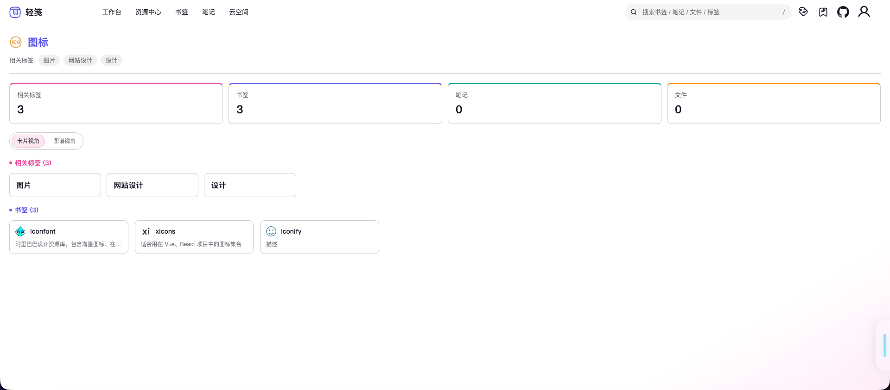
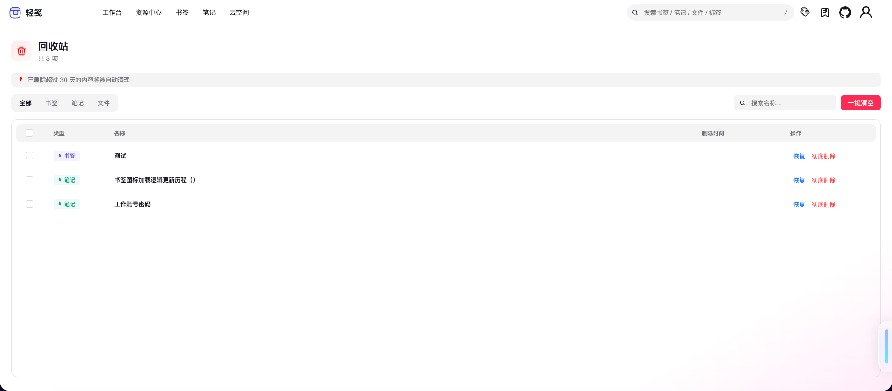

# 轻笺 LightNote

> **以标签为纽带，串联你的书签、笔记与文件。**

轻笺是一个围绕**统一标签体系**构建的知识管理系统。不只是一个书签收藏工具——它将网址、笔记、文件组织在同一套标签语义下，配合 AI 辅助、标签图谱、全局搜索，帮你构建可检索、可关联、可沉淀的个人知识库。

🌐 **在线体验**：[boluo66.top](https://boluo66.top) · 桌面端 + 移动端全适配


---

## 功能全景

### 🏷️ 统一标签体系

所有资源（书签、笔记、文件）共享同一套标签。一个标签关联多种资源，一个资源绑定多个标签，形成**跨类型的知识网络**。

- 标签树拖拽排序 · 标签关系图谱可视化（基于 G6）
- 标签详情聚合页：一键查看某标签关联的所有书签/笔记/文件
- 批量标签操作：多选资源统一添加/移除标签




### 🏠 书签总览

进入书签模块。左侧标签树导航，右侧展示选中标签下的书签卡片，边选边看。

- 标签树检索、拖拽排序，快速筛选书签
- 卡片墙展示，支持多标签联合过滤
- 右键快捷操作：编辑、删除、复制链接
- 书签智能抓取网页标题、描述与图标


### 📝 笔记库

卡片与列表双视图浏览，支持标签筛选和关键词搜索，快速定位笔记。

- 富文本编辑器（TinyMCE），支持图文、表格、代码块、高亮
- 卡片/列表双视图（桌面端）
- 目录（TOC）导航
- 标签筛选 + 关键词搜索
- 批量删除、拖拽排序
- 导出 PDF


### ☁️ 云空间

个人文件中心，默认 1GB 配额。

- 支持图片/视频/PDF/Word/Excel/音频等多类型文件上传预览
- 文件夹管理 + 文件移动 + 拖拽排序
- 类型/文件夹双维度过滤与搜索
- Office 文件在线预览 · 图片/PDF/音视频原生预览
- 外部分享下载（生成分享链接）
- 严格权限隔离，用户仅可访问自己的资源


### 🤖 AI 助手

内置 AI 对话面板，辅助知识处理。

- 上下文问答 · 翻译切换
- 快捷提问模板
- 流式响应展示


### 🔍 全局搜索

跨模块统一检索入口，一次搜索覆盖书签、笔记、标签和文件。

- 关键词 + 标签联合过滤
- 批量标签筛选（SearchBatchTags）
- 搜索结果聚合展示


### 📊 工作台

总览面板，聚合展示全局状态。

- 最近 7 天活跃趋势图（G2Plot）
- 高频书签、标签热度排行
- 近期笔记、近期文件快捷入口
- 文件类型分布可视化

### 🗑️ 回收站

统一管理已删除资源，防止误删丢失。



### 🔐 安全中心 & 后台管理

- **安全中心**：账号安全设置
- **后台管理**（Root 角色）：
  - API 日志 / 操作日志审计
  - 用户管理 · 用户反馈处理
  - 图片管理 · SQL 控制台
  - 帮助文档管理

### 🧭 更多能力

- **国际化**：完整中英文双语支持（vue-i18n）
- **多端适配**：桌面 + 移动端响应式布局
- **主题系统**：基于 CSS 变量的浅色/深色主题
- **WebSocket**：实时通知推送
- **拖拽体系**：书签/标签/笔记/文件全模块拖拽排序
- **埋点追踪**：操作日志 + 点击行为分析

<div style="display: flex; ">


</div>

---

## 技术栈

| 层级      | 技术选型                         |
| --------- | -------------------------------- |
| 框架      | Vue 3 + TypeScript + Vite        |
| 状态/路由 | Pinia + Vue Router               |
| UI        | Ant Design Vue 4.x               |
| 图表/图谱 | G2Plot + G6（AntV）              |
| 编辑器    | TinyMCE + CodeMirror（SQL/JSON） |
| 文档预览  | @vue-office（docx/xlsx/pdf）     |
| 拖拽      | vue-draggable-plus               |
| 国际化    | vue-i18n（zh-CN / en-US）        |
| HTTP      | Axios                            |
| 后端      | Node.js + Express + MySQL        |
| 实时通信  | WebSocket                        |
| 构建/CI   | GitHub Actions                   |

---

## 快速开始

```bash
# 克隆前端
git clone https://github.com/VeteranBoLuo/light-note
cd light-note

# 安装依赖
pnpm install

# 本地开发（默认 http://localhost:5173）
pnpm dev

# 生产构建
pnpm build
```

需要后端？请同步启动 [light-note-back](https://github.com/VeteranBoLuo/light-note-back)（导入 SQL → 配置数据库连接 → `node app.js`）。

---

## 设计理念

轻笺的核心理念是**以标签为第一公民**：

- **标签即组织**：不依赖文件夹层级，用标签的交叉覆盖自然组织知识
- **标签即搜索**：通过标签关联实现跨类型的聚合检索
- **标签即发现**：标签图谱揭示知识点之间的隐性联系

---

## 路线图

- **知识联想**：基于标签网络和 AI 推荐相关内容
- **自动化标签**：新资源入库时 AI 自动建议标签
- **知识卡片联动**：笔记与书签双向引用，形成知识闭环
- **开放 API**：为第三方工具提供标签化存取接口
- **协作共享**：标签级权限控制的知识协作空间

---

## 更新日志

[查看更新日志 →](https://boluo66.top/updateLogs)

---

## 贡献

欢迎提交 Issue 和 PR。项目正处于活跃开发阶段，任何建议和贡献都很有价值。

---

## Stargazers

[](https://github.com/VeteranBoLuo/light-note/stargazers)
