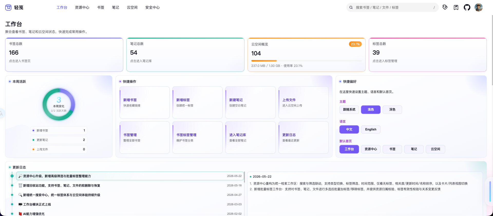
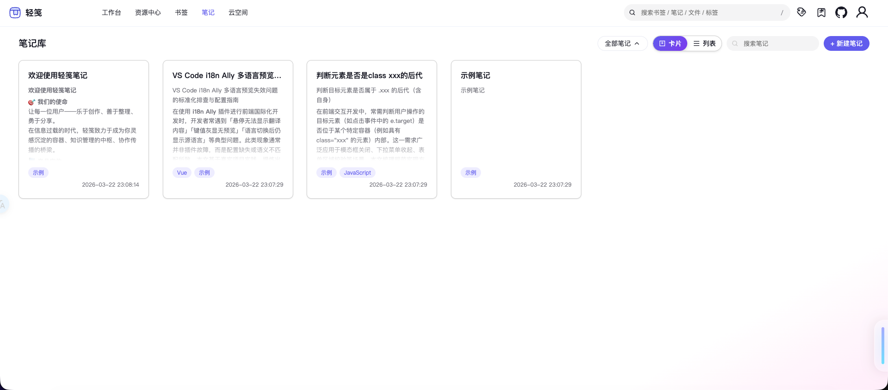
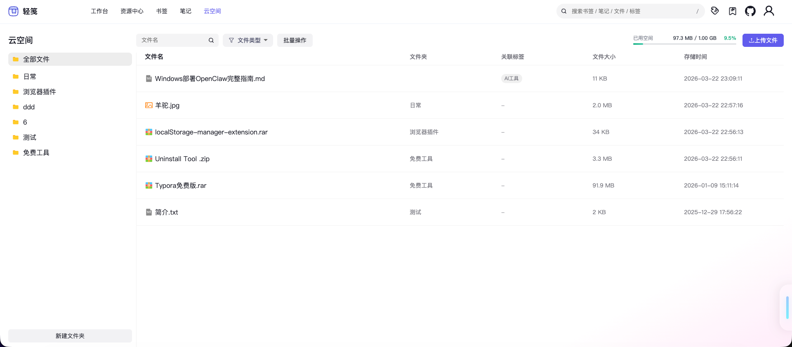
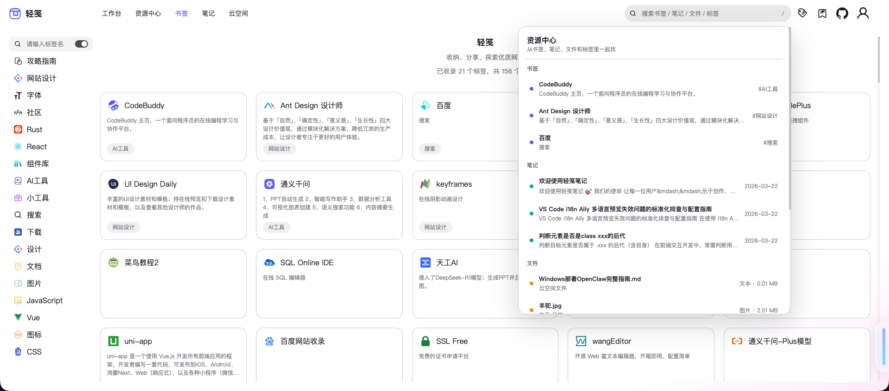
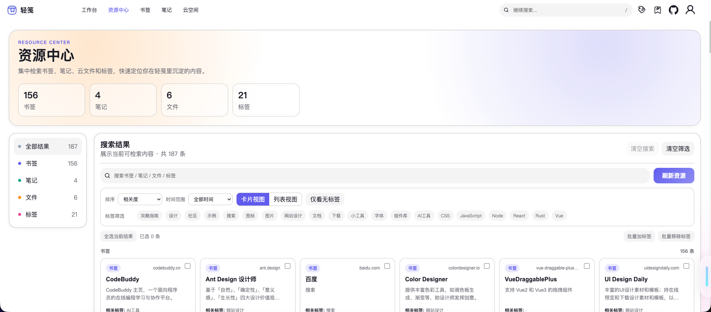
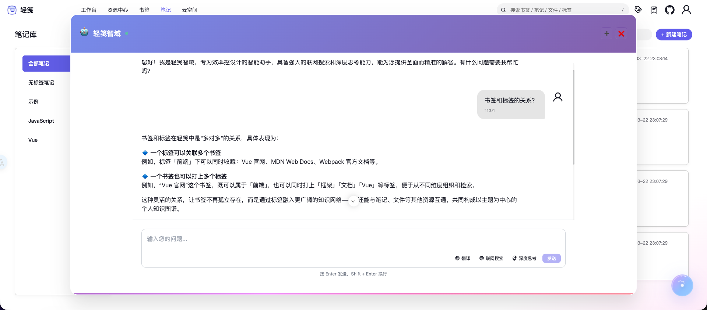
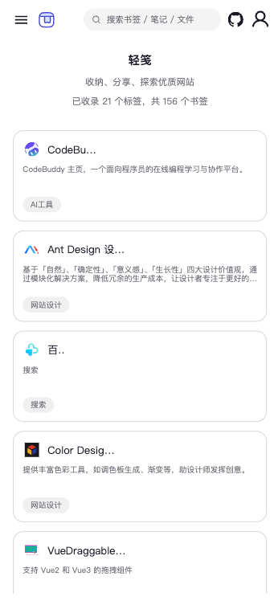

  
  
  
  

 

<h1 align="center">📦 轻笺 · LightNote</h1>

  <b>书签 + 笔记 + 云文件 &nbsp;·&nbsp; 三合一个人知识库</b>
   
  用标签串联你所有的数字碎片

  <a href="https://boluo66.top"><b>🌐 在线体验</b></a>
  &nbsp;·&nbsp;
  <a href="#-功能一览">功能</a>
  &nbsp;·&nbsp;
  <a href="#-技术栈">技术栈</a>

 

  

 

---

## 这是什么

你每天都会遇到这些事——

- 刷到一篇好文章 → 存浏览器收藏夹 → **再也没打开过**
- 随手写的笔记散落在备忘录、Notion、本地 txt 里
- 工作文件在微信、邮箱、网盘之间 **来回传**

**轻笺就是解决这个问题的。**

书签、笔记、文件统一管理，用标签串联。想找什么，一个地方就翻到。

---

## ✨ 功能一览

### 🔖 书签

页面标题、描述、图标自动抓取。左侧标签树导航，右侧卡片墙，多标签联合过滤。再也不用在几百个收藏夹链接里翻上翻下。

---

### 📝 笔记库

富文本编辑器，图文、表格、代码块都支持。多级文件夹归类，目录自动导航。卡片/列表双视图，还能导出 PDF。

---

### ☁️ 云空间

文件上传到云端，在线预览 Office 文档、图片、音视频。卡片或列表视图浏览，批量操作，外部分享。

---

### 🔍 全局搜索

书签、笔记、标签、文件跨模块统一搜。关键词 + 标签联合过滤，几秒定位。

---

### 🏷️ 统一标签体系

书签、笔记、文件共享同一套标签。一个标签关联多种资源，一个资源绑定多个标签，形成跨类型的知识网络。标签关系图可视化，知识点一目了然。

---

### 🤖 AI 助手

内嵌 AI 对话，辅助知识处理。上下文问答、快捷提问模板、流式响应。

---

### 更多能力

- 🌙 **深色/浅色主题** — CSS 变量体系，一键切换，护眼
- 📱 **移动端适配** — 两套独立布局，触控优化，路上随时用
- 🌐 **中英文双语** — vue-i18n 完整支持
- 🗑️ **回收站** — 统一管理已删资源，误删可恢复
- 🛡️ **安全中心** — API 日志审计、用户管理、SQL 控制台、攻击监控
- ⚡ **响应快** — SPA 单页应用，切换页面不刷新

---

## 📱 移动端

桌面端能做的事，手机上同样能做。适配触控操作，边走边记。

  
  

---

## ⚡ 对比

|          | 轻笺          | 浏览器收藏夹 | Notion    | 网盘 |
| -------- | ------------- | ------------ | --------- | ---- |
| 书签管理 | ✅ 标签+搜索  | ✅ 文件夹    | ❌ 太重   | ❌   |
| 笔记书写 | ✅ 富文本     | ❌           | ✅        | ❌   |
| 文件存储 | ✅ 云端+预览  | ❌           | ❌ 付费   | ✅   |
| 标签串联 | ✅ 统一标签   | ❌           | ⚠️ 分模块 | ❌   |
| 速度     | ⚡ 轻量       | ✅           | ❌        | ✅   |
| 自部署   | ✅ 自己服务器 | ❌           | ❌        | ❌   |

**轻笺不是大而全的平台。它是一个属于你自己的、快速、干净的知识收纳盒。**

---

## 🛠️ 技术栈

前端 · Vue 3 · TypeScript · Pinia · Vite · TinyMCE · AntV  
后端 · Node.js · Express · MySQL  
部署 · 华为云 · Nginx · PM2 · OBS 对象存储

---

   
  
    
  如果觉得不错，欢迎 ⭐ <b>Star</b> 支持
   
  每一个 Star 都是作者深夜写代码的动力 ✨
    

