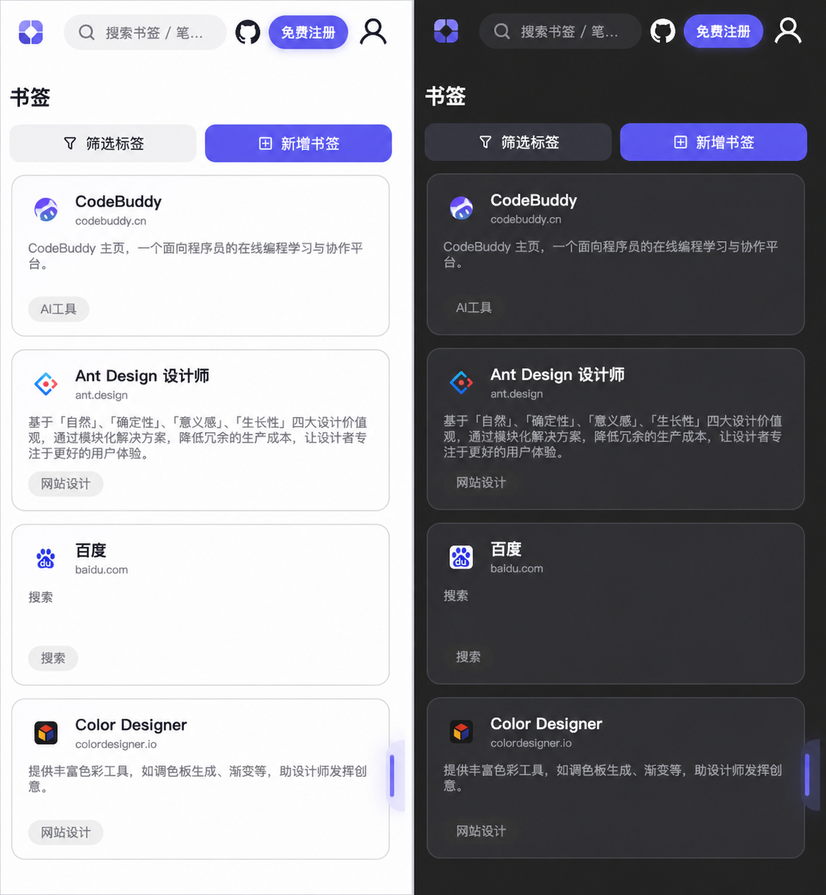

  
  
  
  

<h1 align="center">📦 轻笺 · LightNote</h1>

  <b>免费的书签、笔记与云文件管理平台</b>
   
  书签 · 笔记 · 云文件 · AI 助手 · 跨设备同步
   
  A free online workspace for bookmarks, notes, cloud files and AI-assisted organization.

  

  
  
  
  

---

### 这些事是不是每天都在发生？

❝ 刷到一篇好文章 → 存浏览器收藏夹 → **再也没打开过** ❞  
❝ 随手记的笔记散落在备忘录、Notion、本地 txt → **找不到** ❞  
❝ 工作文件在微信发来、网盘传去 → **来回倒腾** ❞  

**轻笺把它们放到一个地方。** 书签自动抓取、笔记随手记录、文件云端存储，统一标签串联。  
浏览器打开就能用，当前提供**免费在线使用**，不需要自行部署。

  <a href="https://boluo66.top"><b>👉 去试试 → boluo66.top</b></a>

---

## 功能一瞥

**📌 书签管理**  
粘贴链接自动抓取标题、描述、图标。左侧标签树导航，右侧卡片墙，多标签联合过滤。

  

---

**📝 笔记库**  
富文本｜Markdown 双模式编辑，可实时切换；文字、图片、表格、代码块一应俱全。多级文件夹归类，卡片/列表双视图，支持导出 PDF，移动端也能随时记录。

  

---

**☁️ 云空间**

按文件夹和文件类型集中管理资料，支持上传、搜索、在线预览、拖放整理、批量操作与关联标签；存储空间用量清晰可见，常用文件随时跨设备访问。

  

---

**🔍 全局搜索**  
书签、笔记、标签、文件跨模块统一搜，关键词 + 标签联合过滤，几秒定位。

  

---

**🤖 AI 助手**  
内置对话式 AI，可调用工具帮你查询书签、笔记、成长数据，支持联网搜索、深度思考与流式响应。

  

---

**💡 [共建轻笺](https://boluo66.top/co-build)**

公开查看用户建议、开发者回复与真实进度，了解哪些需求正在规划、开发或已经上线；登录后也可以提交建议和参与投票。

  

---

**更多能力** 🌱 成长体系（签到/积分/成就） · 📚 知识库 · 🕸️ 关系图谱 · 🔗 笔记分享 · 🌙 深色/浅色主题 · 📱 移动端适配 · 🌐 中英文双语 · 🗑️ 回收站 · 🏷️ 统一标签 · 🛡️ 安全中心

---

## 跟主流工具比

| 维度 | 轻笺 | Notion | Cubox | Raindrop |
|------|------|--------|-------|----------|
| 书签管理 | ✅ 标签+搜索 | ❌ 太重 | ✅ | ✅ |
| 笔记书写 | ✅ 富文本 + Markdown | ✅ | ❌ | ❌ |
| 文件存储 | ✅ 云端+预览 | ❌ 付费 | ❌ | ❌ |
| 统一标签 | ✅ **跨类型** | ⚠️ 分模块 | ✅ | ❌ |
| 在线版 | 🆓 **免费使用** | 💰 $10/月 | 💰 ¥10/月 | 💰 $3+/月 |
| 体验 | ⚡ **轻量快速** | ❌ 慢 | ✅ 快 | ✅ 快 |

**没有大平台那么重，也没有单一工具那么局限。**

---

## ⚡ 开始使用

1. 打开 **[boluo66.top](https://boluo66.top)**
2. 注册账号（30 秒）
3. 开始收纳你的数字碎片

支持桌面端 + 移动端，数据云端同步，走到哪跟到哪。

  

---

## 🛠️ 技术栈

前端 · Vue 3 · TypeScript · Pinia · Vite · TinyMCE · AntV  
后端 · Node.js · Express · MySQL  
部署 · 华为云 · Nginx · PM2 · OBS 对象存储

---

## 💻 源码与开发者说明

轻笺首先是一项面向用户的在线服务，本仓库同时开放源代码，方便了解实现、提交问题和参与改进。

- **只想使用轻笺：** 直接访问 **[boluo66.top](https://boluo66.top)**，无需准备服务器或配置环境。
- **想参与开发：** 请阅读 **[贡献指南](CONTRIBUTING.md)** 和 **[开发文档](docs/development.md)**。
- **想自行部署：** 完整生产环境依赖数据库、对象存储、缓存、邮件及第三方 AI 服务，目前暂不提供面向普通用户的一键自托管方案。

源代码采用 [MIT License](LICENSE)。线上服务的存储空间、AI 能力及使用额度以站内说明为准。

---

  
    
  觉得好用 → ⭐ <b>Star</b> 支持一下
   
  有想法 → 提 <a href="https://github.com/VeteranBoLuo/light-note/issues">Issue</a> 或查看 <a href="CONTRIBUTING.md">贡献指南</a>
   
  每一个 Star 都是深夜写代码的动力 ✨

