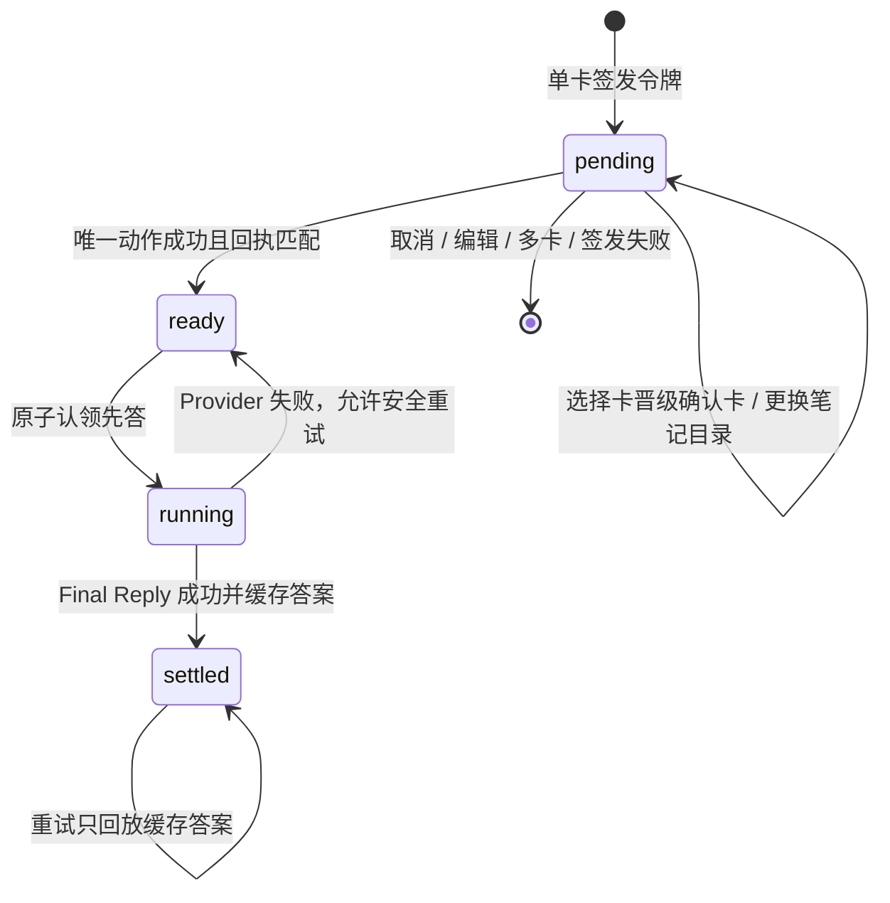

# 轻笺智域卡片动作续答落地方案

> 状态：v1 已进入代码实现；目标分支 `codex/ai-action-continuation`，基线为 2026-08-09 最新 `origin/main`。

## 1. 问题与目标

当前 Agent 主链是：用户消息 → Semantic Planner → 最多 3 轮工具 → Final Reply。只要本轮出现确认卡或选择卡，Final Reply 就会暂停，防止模型把“等待确认”误说成“已经执行”。用户点击卡片后，独立接口只结算选择或执行写工具，前端把权威回执追加到原消息，AI 不会继续完成原始问题的自然语言回答。

v1 目标是在不改变现有卡片协议的前提下增加一层 Action Continuation：

- 写操作仍只允许通过既有一次性确认接口执行；
- 卡片成功结算后，只有确实需要自然语言收尾时才再次调用 AI；
- 续答不重新进入 Planner、不开放工具，不可能重复创建资源；
- 原创建笔记、书签、标签、待办、附件保存等卡片仍按原事件和组件渲染；
- 取消、编辑、失败、结果未知、多卡并发默认终止，不猜测下一步；
- 续答失败不能覆盖已经成功的业务动作和权威回执。

原型见 [ai-action-continuation-prototype.html](./ai-action-continuation-prototype.html)。

## 2. 协议

客户端通过 `agent_continuation_v1` 声明能力。服务端只在能力存在且 `AI_ACTION_CONTINUATION_ENABLED !== 'false'` 时签发续答令牌。

```ts
interface AiActionContinuation {
  schemaVersion: 1;
  token: string;
  policy:
    | 'terminal'
    | 'promote_confirmation'
    | 'final_reply'
    | 'resume_plan'
    | 'offer_followup'
    | 'edit';
  labelKey?: string;
  expiresAt?: string;
}
```

v1 只有 `final_reply` 会被 Web 客户端自动执行。其他枚举是协议保留位，当前一律保持显式或终止语义，不能借枚举名直接进入 Planner。

续答仍复用 `POST /api/chat/agent`：

```json
{
  "message": "继续根据刚才已完成的操作回答",
  "trigger": "card_continuation",
  "continuationToken": "opaque-token",
  "sessionId": "server-session-id",
  "stream": true,
  "clientCapabilities": ["agent_interaction_v1", "agent_continuation_v1"]
}
```

`message` 只用于在对话中形成可见的用户轮次。服务端不信任该文本，而是从 Redis 私有快照恢复原始问题、前序工具事实、动作绑定和权威成功回执。

## 3. 服务端状态机



私有记录绑定：

- owner 摘要；
- 服务端会话 ID；
- 当前动作类型与动作 ID；
- 原始问题、locale、原请求 ID；
- 同轮前序工具的受限摘要；
- 权威 `actionReceipt`；
- 状态、结果摘要、最终答案摘要校验值与过期时间。

令牌明文不进入 Redis key，只保存 SHA-256 摘要；默认有效期 15 分钟。选择卡晋级确认卡、笔记目标目录替换时必须由服务端原子重绑动作 ID。

## 4. 前端交互

1. 原助手消息照常展示选择卡或确认卡。
2. 用户选择后，若涉及写入，仍只晋级为原 `AiToolConfirmationCard`。
3. 用户确认后，卡片先校验权威回执并完成原结算、历史持久化。
4. 若成功响应携带 `policy=final_reply`，前端新增一条可见用户消息，再走原 SSE Agent 请求。
5. 新的 AI 消息独立流式展示；续答失败时只影响这条消息，原卡片仍保持成功。

对于声明新 capability 的 SSE 请求，服务端会等整轮规划结束、确认只有一张未决卡片并完成私有快照后，再发送该卡片事件，避免第一张卡先拿到续答令牌而同轮随后又出现第二张卡。未声明 capability 的旧客户端保持原发送时序。

不新增“万能卡片”。`AiInteractionCard`、`AiToolConfirmationCard` 和后续 Artifact/Job 卡片各自保留业务状态机，只共享 `AiActionContinuation` 出口。

## 5. 兼容与失败关闭矩阵

| 场景 | 原动作 | 是否调用 AI 续答 | 结果 |
| --- | --- | --- | --- |
| 老客户端无 capability | 原样 | 否 | 完全保持旧行为 |
| 单张确认卡成功 | 正常执行一次 | 是，Final Reply only | 新增可见续答轮次 |
| 选择卡晋级确认卡后成功 | 正常晋级并执行 | 是 | 令牌随动作 ID 重绑 |
| 取消或返回编辑 | 不执行写入 | 否 | 原卡片终止/编辑 |
| 写操作失败 | 权威失败 | 否 | 不用 AI 粉饰结果 |
| 写入结果未知 | 保持可安全重试 | 否 | 禁止续答 |
| 同轮两张及以上卡片 | 各自保持原确认 | 否 | v1 不猜测顺序 |
| 续答 Provider 失败 | 动作仍成功 | 可安全重试续答 | 不回滚业务结果 |
| 续答请求重放 | 不执行工具 | 不重复调用 Provider | 回放 Redis 缓存答案 |

## 6. 与 Artifact / 长任务的扩展点

死链体检、批量分析、导入导出等长任务不应在点击后占用一次长 HTTP Agent 请求。后续 Job 卡片应使用：

- 点击开始：确定性创建 Job，展示真实进度；
- 运行中：SSE/轮询只读 Job 状态，不调用 LLM；
- 完成：展示结果与“根据结果继续分析”按钮；
- 用户显式点击后，使用 `offer_followup` 或受限的 `final_reply`；
- “重新体检”创建新的幂等 Job，不读取旧结果冒充本次执行。

v1 已提供通用协议和安全令牌存储，Job/Artifact 组件接入时无需修改现有资源创建卡。

## 7. 验证门禁

- Store：owner/session/action 绑定、晋级重绑、成功前禁止续答、原子认领、结果缓存；
- Handler：续答不进入 Planner、不选择工具；确认成功才激活令牌；
- Web：只有 `final_reply` 自动续答；terminal/resume_plan 不自动执行；
- 回归：创建笔记确认预览、目录替换、回执校验、选择卡晋级、老客户端无 capability；
- 工程：服务端语法检查、定向 Vitest、Web 类型检查/构建、`git diff --check`。

## 8. 发布与回滚

- 灰度开关：`AI_ACTION_CONTINUATION_ENABLED=false` 可立即关闭服务端签发和消费；
- 前端 capability 可独立撤回；服务端没有 capability 时回到 terminal；
- Redis 数据有 TTL，无 Schema 迁移；
- 知识库同步脚本只在发布时按既有知识库流程执行，不随本次本地开发自动写库。
