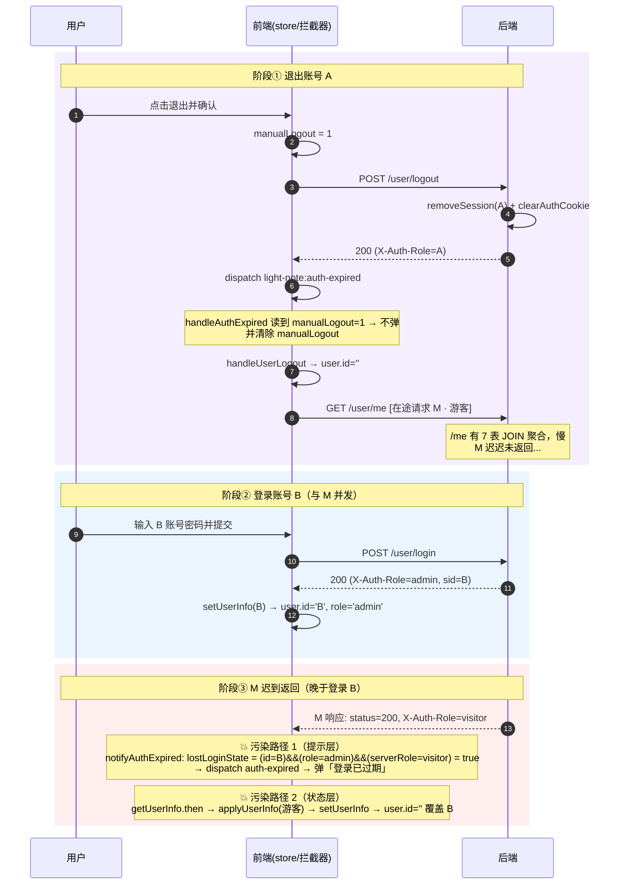
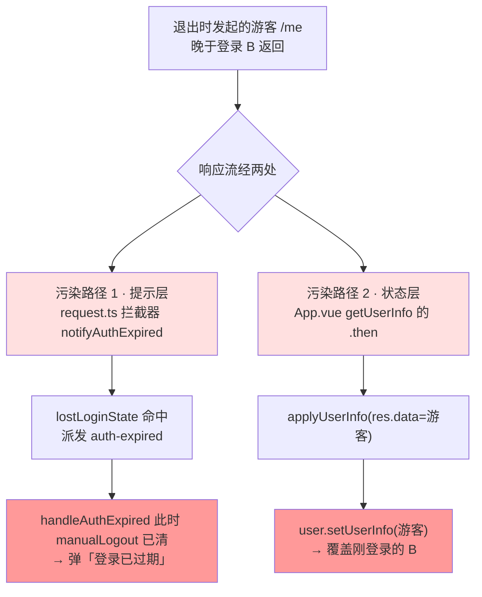
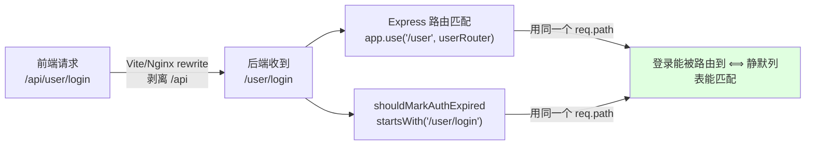
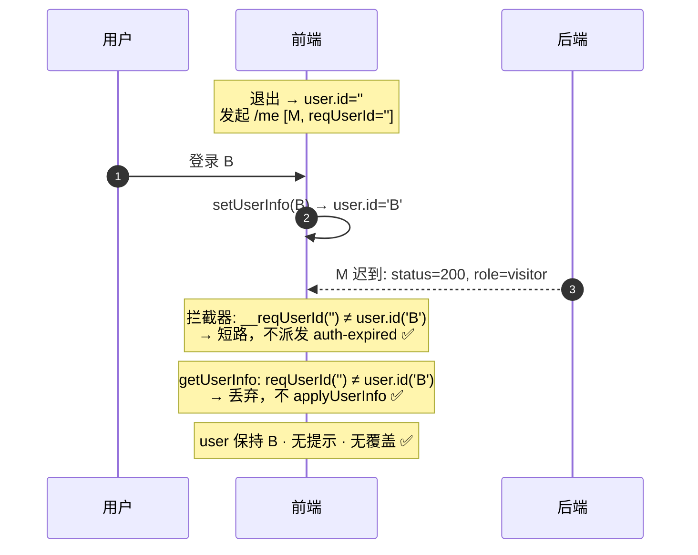

# 退出后重新登录闪现「登录已过期」问题复盘

> 状态：已定位根因并修复 · 前端 `pnpm typecheck` 通过 · 后端 `node --check` 通过 · 未 build / 未部署
>
> 关键词：会话过期误报、在途请求竞争（stale in-flight response）、请求身份纪元指纹、fail-safe 安全边界

---

## 目录

1. [问题现象](#一问题现象)
2. [认证体系速览](#二认证体系速览背景知识)
3. [初始排查方向与逐一排除](#三初始排查方向与逐一排除)
4. [根因定位](#四根因定位)
5. [修复方案演进（三个回合）](#五修复方案演进三个回合)
6. [后端隐患加固](#六后端隐患加固shouldmarkauthexpired-路径耦合)
7. [最终方案总览](#七最终方案总览)
8. [复盘要点与经验教训](#八复盘要点与经验教训)

---

## 一、问题现象

### 现象描述

退出当前账号 → 登录另一账号 → 登录成功 → 弹出 `登录已过期，请重新登录` toast，**但实际已登录成功，页面功能正常**。

### 复现步骤

1. 登录账号 A
2. 点击退出（触发 `handleExitLogin`）
3. 确认退出
4. 点击登录按钮，打开登录弹框
5. 输入账号 B 的邮箱密码，点击登录
6. 登录 API 返回 200，页面跳转到首页
7. **闪现** `登录已过期，请重新登录` 提示

### 现象特征（这些细节是定位根因的关键线索）

| 特征 | 说明 | 指向 |
|---|---|---|
| 提示是「闪现」的 | 一闪而过，不是常驻 | 有个瞬时事件触发后又被覆盖 |
| 实际已登录成功 | user 最终是 B | 登录本身没失败 |
| 页面功能正常 | 刷新后一切正常 | 登录态最终能恢复 |
| 只在「退出→登录」序列出现 | 单纯登录不复现 | 与退出流程的某个残留有关 |
| 线上比本地更容易复现 | 服务器 1.7GB 内存 | 与请求耗时/时序竞争有关 |

---

## 二、认证体系速览（背景知识）

### 相关文件

| 层 | 文件 | 职责 |
|---|---|---|
| 前端·HTTP | [`apps/web/src/http/request.ts`](../../apps/web/src/http/request.ts) | axios 拦截器，`notifyAuthExpired` 判定会话过期并派发事件 |
| 前端·根组件 | [`apps/web/src/App.vue`](../../apps/web/src/App.vue) | `handleAuthExpired` 事件处理、`getUserInfo` 拉用户信息、`applyUserInfo` 写 store |
| 前端·登录页 | [`apps/web/src/components/login/LoginPage.vue`](../../apps/web/src/components/login/LoginPage.vue) | `handleLogin` 登录成功后写 store、跳转 |
| 前端·个人中心 | [`apps/web/src/view/personCenter/PersonCenter.vue`](../../apps/web/src/view/personCenter/PersonCenter.vue) | `handleExitLogin` 退出登录 |
| 后端·鉴权 | [`apps/server/util/auth.js`](../../apps/server/util/auth.js) | `authMiddleware`、cookie、`markAuthExpired`、白名单 |
| 后端·用户 | [`apps/server/router_handle/userHandle.js`](../../apps/server/router_handle/userHandle.js) | `login` / `logout` / `getUserInfo(/me)` handler |
| 后端·会话 | [`apps/server/util/sessionStore.js`](../../apps/server/util/sessionStore.js) | session 的创建/查询/删除 |

### 认证信号机制

- **凭证**：httpOnly cookie `sid`（主）+ `X-Session-Id` 头（后备，从 `localStorage.rememberedSid` 读，移动端 cookie 易失时兜底）。
- **服务端响应头**：
  - `X-Auth-Role`：当前身份（`visitor` / `admin` / `root`）。
  - `X-Auth-Expired: 1`：会话过期提示标记。
  - `X-Auth-Expires-In`：会话剩余秒数（用于前端到期前主动登出定时器）。
- **业务状态码**：响应体 `resultData(data, status, msg)`，`status` 默认 `200`。

### 前端关键状态位

| 状态位 | 位置 | 含义 |
|---|---|---|
| `manualLogout` | sessionStorage | 标记「本次是手动退出」，退出时不弹过期警告 |
| `ln_auth_ended` | sessionStorage | 一次性抑制：同标签内过期提示 + 重定向只做一次 |
| `authExpiredFlow` | request.ts 模块变量 | 过期流程中，请求拦截器不再重放旧 sid |
| `isHandlingAuthExpired` | App.vue | `handleAuthExpired` 重入锁 |

---

## 三、初始排查方向与逐一排除

### 原始记录里的四个怀疑（原因 A/B/C/D）

- **原因 A / B**：退出的 httpOnly cookie 清除有延迟，登录请求携带了残留旧 sid，导致后端 `authMiddleware` 在 `login handler` 之前把请求判过期、设 `X-Auth-Expired: 1`。并附「⚠️ 关键发现」：`AUTH_EXPIRED_SILENT_PATHS` 定义的是 `/user/login`，但若实际路径是 `/api/user/login` 就匹配不上，登录请求也会被标记过期。
- **原因 C**：登录成功后并发请求携带旧 sid 触发过期。
- **原因 D**：`authExpireTimer` 的 setTimeout 到期触发。

### 逐一排除（基于代码事实）

**排除 1：登录响应本身不会弹过期。**

`login` handler 成功分支（[userHandle.js:145-147](../../apps/server/router_handle/userHandle.js)）：

```js
const sid = await issueLoginSession(req, res, result[0], Boolean(rememberMe));
const userInfo = await queryUserInfoById(result[0].id);
res.send(resultData({ ...sanitizeUser(userInfo), sid }));   // status 默认 200
```

`issueLoginSession`（[auth.js:69-83](../../apps/server/util/auth.js)）内部：

```js
setAuthCookie(res, sid, maxAgeMs);
res.removeHeader(AUTH_EXPIRED_HEADER);            // 清掉可能被中间件设的过期头
res.setHeader(AUTH_ROLE_HEADER, user.role);       // admin/root
res.setHeader(AUTH_EXPIRES_IN_HEADER, ...);
```

前端 `notifyAuthExpired`（[request.ts:69](../../apps/web/src/http/request.ts)）对「有效登录响应」有豁免：

```js
if (status === 200 && serverRole && serverRole !== 'visitor') {
  authExpiredFlow = false;
  sessionStorage.removeItem('ln_auth_ended');
  return false;                                   // 命中豁免，不弹
}
```

登录响应 `status=200 + role=admin` → 命中豁免。**登录响应本身不弹。**

**排除 2：`shouldMarkAuthExpired` 路径问题不成立（推翻原因 A/B 的「关键发现」）。**

- 后端 `authMiddleware` 是**顶层**挂载：`app.use(authMiddleware)`（[app.js:33](../../apps/server/app.js)），中间件里 `req.path` 是完整路径。
- 但后端路由前缀是 `/user`（[common.js:170](../../apps/server/util/common.js) `baseRouter` 里 `path: '/user'`），**不是** `/api/user`。
- 前端 `/api/user/login` 经 Vite/Nginx `rewrite: path.replace(/^\/api/, '')`（[vite.config.ts:52](../../apps/web/vite.config.ts)）**剥离了 `/api`**，后端实际收到 `/user/login`。
- 所以 `shouldMarkAuthExpired` 看到的 `req.path === '/user/login'`，`startsWith('/user/login')` 为 **true**，**静默列表正常生效，不会误设过期头**。

> 结论：原因 A/B 关注的 `X-Auth-Expired` header 路径问题**不存在**。本 bug 与该 header 无关，走的是另一条分支（见下）。

**排除 3：原因 C/D 与现象不符。** 退出时 `rememberedSid` 已被清、登录后才重设，旧 sid 不会被并发请求带走；定时器是未来 24h/7d 才触发。均排除。

---

## 四、根因定位

### 关键代码点：`notifyAuthExpired` 的 `lostLoginState` 分支

[request.ts:60-96](../../apps/web/src/http/request.ts)：

```js
function notifyAuthExpired(response?: any) {
  const user = useUserStore();
  const status = response?.data?.status;                          // 业务状态码
  const headerExpired = response?.headers?.['x-auth-expired'] === '1';
  const serverRole = response?.headers?.['x-auth-role'];
  const lostLoginState =
    user.id &&                                                    // 前端认为自己已登录
    user.role !== 'visitor' &&
    (serverRole === 'visitor' || status === 'visitor' || status === 401);

  if (status === 200 && serverRole && serverRole !== 'visitor') {
    authExpiredFlow = false;
    sessionStorage.removeItem('ln_auth_ended');
    return false;                                                 // 有效登录，豁免
  }
  if (headerExpired || lostLoginState) {                          // ← 关键分支
    authExpiredFlow = true;
    ...
    window.dispatchEvent(new CustomEvent('light-note:auth-expired'));
    return true;
  }
  return false;
}
```

**要害**：`lostLoginState` 用的是**当前** `user.id / user.role`，去判定一条**可能早已发出、刚刚才回来**的响应。

### 关键事实：退出流程会发起一个「游客 `/me`」在途请求

退出事件处理 `handleAuthExpired`（[App.vue:328-354](../../apps/web/src/App.vue)）：

```js
handleUserLogout(resetUser);        // → user.resetUserInfo() → user.id=''
bookmark.type = 'all';
if (refreshUser) {
  await getUserInfo(true);          // ← 发起 GET /api/user/me（游客身份）
}
```

而 `/me` 的游客响应（[userHandle.js:295-306](../../apps/server/router_handle/userHandle.js)）是 `status: 200` + 响应头 `X-Auth-Role: visitor`：

```js
if (!userId || role === 'visitor') {
  res.send(resultData({ ...previewUser, id: userId || '', role: 'visitor' }, 200));
  return;
}
```

`X-Auth-Role: visitor` 由 `attachUserToRequest`（[auth.js:108](../../apps/server/util/auth.js)）对无 session 的请求设置。

### 根因：陈旧的在途 `/me` 游客响应，覆盖了新登录态

退出触发的游客 `/me` 请求是**不阻塞 UI** 的（`handleExitLogin` 只 `dispatchEvent` 不 `await` 事件处理）。用户退出后可以立刻打开登录框、输入、提交。若这条 `/me`（游客响应）**晚于登录 B 返回**，就会发生竞争。



### 一条响应，两个独立的污染路径



### 为什么现象是「闪现后自愈」（原始代码下）

原始代码里，污染路径 1 派发的 `auth-expired` 事件**顺带触发了恢复**：

```
notifyAuthExpired 弹过期 → 派发 auth-expired
  → handleAuthExpired 第二次执行
    → handleUserLogout（user 已被游客覆盖）
    → getUserInfo(true) 第二次 /me（此时带 B 的新 cookie）
      → 拉回 B → user.id='B' 恢复
```

于是表现为：**闪一下「登录已过期」→ 短暂游客态 → 立即拉回 B → 功能正常**。完美对应现象特征表。

### 为什么线上稳定复现

`/me` 走 `queryUserInfoById`（7 个 `LEFT JOIN` 聚合，重），在 1.7GB 内存的服务器上**常慢于** `/login`；退出紧接着登录，两请求在途竞争，`/me` 晚归的概率高。

---

## 五、修复方案演进（三个回合）

> 核心原则（贯穿始终）：**陈旧的在途响应（发起时的登录身份 ≠ 响应到达时的身份）不得影响当前会话。**

### 回合一：拦截器身份指纹（堵住污染路径 1）

给每个请求打上「发起时的登录身份」，响应回来时若身份已变，视为陈旧响应，忽略其过期信号。

**改动 1 · 请求拦截器打标**（[request.ts](../../apps/web/src/http/request.ts) 请求拦截器）：

```js
// 记录请求发起时的登录身份:响应回来时若身份已变(如退出后又登录了别的账号),
// 说明这是一条「陈旧的在途响应」,notifyAuthExpired 会据此忽略其过期信号,避免误弹「登录已过期」
(config as any).__reqUserId = useUserStore().id || '';
```

**改动 2 · `notifyAuthExpired` 陈旧短路**（[request.ts](../../apps/web/src/http/request.ts)）：

```js
function notifyAuthExpired(response?: any) {
  const user = useUserStore();
  // 陈旧的在途响应保护:请求发起时的登录身份 ≠ 当前身份,说明这条响应发出后用户已切换身份
  // (典型:退出时发出的游客 /me 响应,晚于「重新登录」才到达)。直接忽略,否则误弹「登录已过期」。
  const reqUserId = response?.config?.__reqUserId;
  if (reqUserId !== undefined && reqUserId !== (user.id || '')) {
    return false;
  }
  const status = response?.data?.status;
  ...
}
```

✅ 提示不再误弹。但——**这只堵了一半。**

### 回合二：发现回归 —— 必须补 `getUserInfo` 层（堵住污染路径 2）

审查「是否有懈可击」时发现关键代码 [App.vue:207-209](../../apps/web/src/App.vue)：

```js
function applyUserInfo(data) {
  if (!data) return;
  user.setUserInfo(data);        // ← 会覆盖整个 user store！
  ...
}
```

`getUserInfo` 的 `.then` 里会 `applyUserInfo(res.data)`。这意味着退出的游客 `/me` 回来后，**即使拦截器不弹提示，`applyUserInfo(游客)` 仍会把已登录的 B 覆盖成游客**。

**更严重的是：回合一的修复引入了回归。** 三种状态对比：

| 时序 | 原始代码 | 只有回合一（拦截器） | 回合一 + 回合二 |
|---|---|---|---|
| M 迟到返回 | 弹过期提示 | 指纹短路，**不弹** ✅ | 指纹短路，不弹 ✅ |
| `applyUserInfo(游客)` | 覆盖 B → user='' | 覆盖 B → user='' ❌ | `getUserInfo` 丢弃，**user 保持 B** ✅ |
| 是否派发 auth-expired | 派发 | **不派发** | 不派发 |
| 恢复机制 | 事件触发第二次 `getUserInfo` 拉回 B | **无事件 → 无恢复** ❌ | 无需恢复（从未被覆盖） |
| 最终结果 | 闪现后自愈（烦但可用） | **静默停在游客态**（更糟！） | 无闪现、无覆盖（完美） |

> 关键教训：回合一挡掉了 `auth-expired` 事件，**却同时挡掉了那个事件顺带触发的「第二次 `getUserInfo` 恢复」**。掩盖 bug 的机制被移除后，底层的 `applyUserInfo` 覆盖问题就暴露成了「登录态永久丢失」。**单层修复比原 bug 更严重。**

**改动 3 · `getUserInfo` 陈旧响应丢弃**（[App.vue](../../apps/web/src/App.vue)）：

```js
if (userInfoRequest) {
  return userInfoRequest;
}

// 记录发起本次 /me 时的登录身份,用于识别并丢弃「陈旧的在途响应」
const reqUserId = user.id || '';
userInfoRequest = (async () => {
  try {
    const res = await apiBaseGet('/api/user/me');
    // 陈旧响应保护:请求在途期间登录身份已变(典型:退出时发出的游客 /me,晚于「重新登录」才返回),
    // 该响应已过时。若继续 applyUserInfo 会用游客数据覆盖刚登录的账号,导致登录态被冲掉且无从恢复,
    // 故整体丢弃——不写 user、不改登录框、不刷通知。当前身份的数据以登录时写入的为准。
    if ((user.id || '') !== reqUserId) {
      return res;
    }
    userInfoLoaded = true;
    applyUserInfo(res.data);
    ...
  } finally {
    userInfoRequest = null;     // 丢弃分支在 try 内 return，finally 仍执行，单例锁正确释放
  }
})();
```

**为什么两层都必要，缺一不可：**

- 拦截器 `notifyAuthExpired` 在 `getUserInfo.then` **之前**执行（拦截器先于业务 `.then`）。所以：
  - 无回合一 → 拦截器仍派发 `auth-expired` → 仍闪现提示。
  - 无回合二 → `applyUserInfo` 仍覆盖登录态 → 登录态丢失。
- 二者是**同一竞争在两层的独立显现**：拦截器管**提示**（覆盖所有请求），`getUserInfo` 管**状态写入**（`/me` 特有，因为只有它会 `setUserInfo`）。

**为什么不用 AbortController / 全局互斥锁（避免过度设计）：** 退出的 `/me` 有其职责（拉游客预览数据），不该被取消；只需在它「迟到且已过时」时丢弃。判断只用一个 `user.id` 对比，零新增状态机。

### 回合三：refreshTag 验证（用代码事实推翻臆测）

回合二后我提出「`bookmark.refreshTag()` 可能也有迟到覆盖的残留竞争，建议不改」。被要求**基于代码、不要臆想**地核实其实际影响后，读了 [useBookmark.ts:187](../../apps/web/src/store/useBookmark.ts)：

```js
refreshTag: async () => {
  const bookmark = bookmarkStore();
  // 游客态不拉取标签，避免过期/登出后仍打 /api/bookmark/queryTagList 报错刷屏
  bookmark.tagList = [];
  if (!userStore().id || userStore().role === 'visitor') {
    return;                                          // ← 游客态直接返回，不发请求
  }
  const res = await apiQueryPost('/api/bookmark/queryTagList', {
    filters: { userId: userStore().id },             // 发起时锁定当前 userId
  });
  bookmark.tagList = res.data || [];
},
```

**代码事实彻底推翻了臆测：**

1. **游客态短路 `return`，根本不发请求**。退出时（user 已被 `handleUserLogout` 置游客）调的 `refreshTag` 走第 5 行 `return` —— 没有网络请求，就没有「迟到的在途响应」，谈何覆盖。作者注释「避免过期/登出后仍打接口报错刷屏」证明这条路早被堵死。
2. 唯一的 `refreshTag` 请求是登录后（user=B）发的，`filters.userId` 同步锁定为 B，拉 B 的标签、写 B 的标签，正确。
3. 退出流程里真正产生在途 API 请求的**只有 `/me` 一个**；`refreshTag` 游客态不发，`opinionNotice` 已被 `stopOpinionNoticePolling` 停掉。

> 结论：`refreshTag` 的「残留竞争」**不存在**，不解决也不会给用户带来任何困扰。**没有需要补的第四处，方案闭合。**
>
> 教训：「不改但知情」的上一轮表述是基于臆测（以为游客 `refreshTag` 会发请求）。核实后是**根本无事可改**。**——臆测必须让位于代码事实。**

---

## 六、后端隐患加固（`shouldMarkAuthExpired` 路径耦合）

排查中曾担心「静默列表 `/user/login` 是不是恰好因为 rewrite 剥离 `/api` 才没失效」。核实后澄清并加固。

### 澄清：不是「侥幸」，是「同源耦合」



- 静默列表前缀 `/user/*` == 后端路由挂载前缀（`baseRouter` 的 `/user`），两者用**同一个 `req.path`**。
- **「登录请求能被路由到 handler」⟺「静默列表能匹配它」**，逻辑等价。只要登录功能没坏，静默列表就一定对。
- **反证**：旁边的 `accountBanMiddleware` 用**完全一样**的 `/user/*` 前缀 + `startsWith`（[auth.js:180-196](../../apps/server/util/auth.js)），它是封禁安全边界、线上正常工作 —— 直接证明后端收到的路径就是 `/user/*`。
- `rewrite` 只是命名空间转换，不是「救命」。真正让它对的是「列表前缀 == 挂载前缀」。

### 真正的弱点：维护期一致性 + 两个列表安全性质相反

隐患是存在的，但性质是**「`/user` 前缀在三处各写一遍」**（路由挂载 + `AUTH_EXPIRED_SILENT_PATHS` + `ACCOUNT_BAN_ALLOWED_PATHS`），将来改挂载前缀或新增公开接口时要人肉同步，易漏。且**两个列表安全性质相反，不能一刀切**：

| 列表 | 作用 | 漏配/失配后果 | 能否放宽匹配 |
|---|---|---|---|
| `AUTH_EXPIRED_SILENT_PATHS` | 只决定是否设 `X-Auth-Expired` **提示头** | 至多**多弹一次**「登录已过期」（session 无效时用户一律降级游客，与它无关） | ✅ 可以，fail-safe |
| `ACCOUNT_BAN_ALLOWED_PATHS` | 决定**被封用户能访问哪些接口** | 匹配变宽 → 被封用户可能借子串**绕过封禁** | ❌ 必须精确 |

> 关键认知：`shouldMarkAuthExpired` 的返回值**只影响 `X-Auth-Expired` 提示头，不是鉴权边界** —— session 无效时无论如何都被 `attachUserToRequest` 降级为游客。所以放宽它是 fail-safe 的（最坏是该弹的没弹）。

### 加固改动（[auth.js](../../apps/server/util/auth.js)）

**SILENT 列表：`startsWith` → `includes` 兜底 + 注释**（零行为变更，`includes` 是 `startsWith` 超集；未来即便 `req.path` 带上 `/api` 也照命中）：

```js
// 免鉴权的公开接口:带失效 sid 打到这里不算「会话过期」,不设 x-auth-expired 提示头。
// 前缀取自后端路由挂载点(baseRouter 的 '/user' + 子路由),改挂载前缀或新增公开接口时须同步这里。
// 注意:该判断只影响前端「是否弹登录已过期」的提示,不是鉴权边界——session 无效一律降级游客,
// 与本列表无关,所以匹配放宽是 fail-safe 的(最坏只是本该静默的接口多弹一次提示)。
const AUTH_EXPIRED_SILENT_PATHS = [ '/user/login', '/user/github', '/user/registerUser', '/user/sendEmail', '/user/verifyCode' ];

const shouldMarkAuthExpired = (req) => {
  const path = req.path || req.originalUrl || '';
  // 用 includes 兜底:即便将来代理层不再剥离 /api(req.path 变成 /api/user/login),也能命中静默列表,
  // 解除对「代理必须剥离前缀」的隐性依赖。放宽在这里是安全的(见上方说明,非鉴权边界)。
  return !AUTH_EXPIRED_SILENT_PATHS.some((item) => path.includes(item));
};
```

**ban 列表：只加警示注释，逻辑保持 `startsWith` 精确**（安全边界不可放宽）：

```js
// 被封禁用户仍可访问的白名单接口。前缀同样取自 baseRouter 的 '/user' 挂载点,改挂载前缀时须同步。
// ⚠️ 这是封禁安全边界(不同于上面的提示用列表):匹配必须保持精确 startsWith,
//    绝不可放宽为 includes——否则被封用户可能借路径子串绕过封禁访问未授权接口。
const ACCOUNT_BAN_ALLOWED_PATHS = [ '/user/login', '/user/logout', ... ];
```

---

## 七、最终方案总览

### 三处改动，同一个原则

| # | 文件 | 落点 | 挡住的症状 | 风险 |
|---|---|---|---|---|
| 1 | [request.ts](../../apps/web/src/http/request.ts) | 拦截器身份指纹 + `notifyAuthExpired` 短路 | 误弹「登录已过期」（覆盖所有请求） | 低，零行为变更 |
| 2 | [App.vue](../../apps/web/src/App.vue) | `getUserInfo` 陈旧响应丢弃 | 游客数据覆盖已登录账号（`/me` 特有） | 低，仅新增陈旧判断 |
| 3 | [auth.js](../../apps/server/util/auth.js) | SILENT 用 `includes` + 两列表注释 | 前缀耦合的维护期隐患 | 无，SILENT 零行为变更 / ban 纯文档 |

### 修复后正确时序



### 边界场景验证（均正确）

| 场景 | 拦截器指纹 | getUserInfo 丢弃 | 结果 |
|---|---|---|---|
| 退出→登录，`/me` 晚归（本 bug） | `''≠'B'` 短路 | `''≠'B'` 丢弃 | 不弹、不覆盖 ✅ |
| 退出→登录，`/me` 早归（正常退出） | `''=''` 放行 | `''=''` 放行 | 正常游客态 ✅ |
| 登录响应自身 | `''=''` 放行→命中登录豁免 | 不经过 | 正常登录 ✅ |
| 正常会话过期 | `'B'='B'` 放行→正常判过期 | `'B'='B'` 放行→变游客 | 正常弹过期 ✅ |
| 首屏加载（有/无 cookie） | `''=''` 放行 | `''=''` 放行 | 正常加载 ✅ |
| 重登同账号（A→退出→A） | `''≠'A'` 短路 | `''≠'A'` 丢弃 | 正确丢弃陈旧游客响应 ✅ |

### 验证与部署

- ✅ 前端 `pnpm typecheck`（`apps/web` + `@lightnote/shared` 两包）均 `Typecheck passed`。
- ✅ 后端 `node --check apps/server/util/auth.js` 通过。
- ⛔ 按 [AGENTS.md](../../AGENTS.md) 部署禁令：**未 build、未部署、未上传**。

---

## 八、复盘要点与经验教训

1. **臆测必须让位于代码事实。** 「refreshTag 残留竞争」「shouldMarkAuthExpired 路径失效」两个怀疑，都在读了真实代码后被推翻。凡是「可能」「大概会」，都要落到具体代码行才算数。

2. **警惕「掩盖机制」。** 原 bug 表现为「闪现后自愈」，是因为过期事件顺带触发了恢复。回合一天真地只堵提示，反而移除了恢复路径，把「烦人但可用」变成「静默的登录态丢失」。**修一个 bug 前，先搞清它当前为什么还能勉强工作——那个「勉强」往往是另一个补丁。**

3. **一条陈旧响应可能有多个污染出口。** 同一个迟到的 `/me`，既污染「提示层」（拦截器）又污染「状态层」（`setUserInfo`）。只堵一处不叫修复。定位竞争后要问：**这条数据流经了哪些会写状态/触发副作用的地方？**

4. **区分「安全边界」与「体验开关」。** `AUTH_EXPIRED_SILENT_PATHS`（提示）可以 fail-safe 放宽，`ACCOUNT_BAN_ALLOWED_PATHS`（封禁）必须精确。看似相同的两段 `startsWith` 白名单，放宽的后果一个是「多弹提示」，一个是「越权绕过」。

5. **「完美」与「不过度设计」的平衡点。** 完美 = 两层都堵（缺一有可观测缺陷）；不过度 = 用一个 `user.id` 对比，而非 AbortController / 全局锁 / 请求序号状态机。**判断标准：去掉它是否有可观测缺陷？加上它是否解决真实存在（而非臆想）的问题？**

---

*文档整理时间：2026-07-12 · 复盘范围：本轮「退出后重新登录闪现登录已过期」问题的发现 → 定位 → 修复 → 隐患加固 → 验证全过程。*
