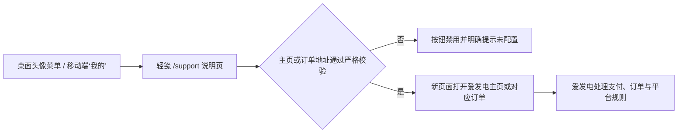

# 轻笺爱发电支持模块落地方案

## 1. 落地结论

第一阶段采用“轻笺说明页 + 爱发电官方下单页”的第三方赞助模式：轻笺不接支付接口、不保存支付信息、不处理资金，用户从个人中心进入 `/support`，确认边界后选择固定档位或自选金额，在新页面打开爱发电完成赞助。

这条链路适合快速上线：不用申请微信支付或支付宝商户能力，也不需要先建设订单、退款、对账和财务后台。创作者主页、三个方案和自选金额链接已经确认；正式收款前还需补齐爱发电主页资料、完成提现设置，并逐档做一次小额真实支付验证。



## 2. 产品原则

- 轻笺核心功能永久免费，赞助不解锁核心功能，也不影响未赞助用户的权益。
- 页面统一使用“支持”“赞助”，不包装为慈善捐赠，也不承诺投资回报。
- 轻笺不收集银行卡、付款码、支付宝/微信密码等支付信息。
- 第一阶段不伪造赞助人数、金额、排行榜或“最近有人支持”的氛围数据。
- 爱发电账号与轻笺账号尚未关联，因此第一阶段不自动奖励积分、经验或徽章。
- 未来做感谢墙或排行榜时，必须先取得赞助者的公开授权，并提供匿名、撤回和不参与选项。

## 3. 页面原型

页面使用同一份响应式实现，桌面端保留应用顶部导航，移动端使用统一二级页顶栏。

1. 首屏主张
   - “轻笺会一直免费。你的支持，让它走得更远。”
   - “永久免费 · 自愿支持”实色标签。
   - 主按钮“查看爱发电主页”，旁边明确第三方平台与新页面跳转。
2. 支持方式
   - ¥6、¥18、¥50 三张固定档位卡。
   - 一张自选金额卡。
   - 每张卡直达对应的爱发电官方订单，不在轻笺内输入或处理支付信息。
3. 三项承诺
   - 核心功能永久免费。
   - 完全自愿。
   - 隐私优先。
4. 支持用途
   - 服务器与存储。
   - 稳定与安全。
   - 持续开发。
5. 第三方边界
   - 将离开轻笺进入爱发电。
   - 支付、订单、退款及平台规则由爱发电处理。
   - 轻笺不接触支付凭据。
   - 当前不自动发放站内奖励或生成榜单。
6. 感谢机制预告
   - 说明未来感谢墙必须以明确授权和可靠账号关联为前提。
   - 不展示任何虚构占位名单。

## 4. 收款地址配置

项目默认使用已确认的公开创作者主页，部署时仍可通过 Vite 变量 `VITE_AFDIAN_SUPPORT_URL` 显式覆盖：

```dotenv
VITE_AFDIAN_SUPPORT_URL=https://afdian.com/a/lightnote
```

这个地址本身是用户最终会访问的公开页面，不需要、也禁止把爱发电密码、支付密码、Token 或收款凭据写入前端环境变量。

创作者主页只接受以下形态：

- `https://afdian.com/a/<creator>`
- `https://www.afdian.com/a/<creator>`
- 上述创作者页下的方案或作品集子路径

固定档位和自选金额使用 `https://ifdian.net/order/create`。前端只允许 32 位十六进制 `plan_id` 搭配 `product_type=0`，或单独的 32 位 `user_id`；爱发电复制链接里的空留言、推广码和来源参数会在打开前丢弃。

明文 HTTP、带账号口令的 URL、仿冒域名、非法 ID、错误商品类型、重复核心参数、未知参数和片段都会被拒绝。校验失败时按钮保持禁用并展示原因，避免用户误跳到错误账号。

创建创作者主页和收款方案应以[爱发电官方指南](https://guide.afdian.com/)为准。设置完成后应先用小额真实订单验证收款账户、订单通知和退款入口，再正式发布链接。

需要注意，“快速开通收款渠道”不等于每笔赞助会实时直达个人微信或支付宝。按[爱发电当前官方 FAQ](https://guide.afdian.com/faq/faq-for-creators)，平台收取赞助金额的 6%，创作者获得 94%；当月赞助中归属当月的部分，于下个月 1 日进入爱发电余额后再提现。上线前必须完成爱发电的实名、提现方式和小额实付验证。

## 5. 爱发电创作者主页填写稿

以“核心功能永久免费、赞助完全自愿”为前提，首次开通时按以下内容填写：

| 字段       | 建议值                                                 | 说明                                                  |
| ---------- | ------------------------------------------------------ | ----------------------------------------------------- |
| 创作者名称 | `轻笺 Light Note`                                      | 与产品名称保持一致                                    |
| 正在创作   | `永久免费、专注记录与整理的个人知识管理工具「轻笺」`   | 一句话说清产品和承诺                                  |
| 主页网址   | 优先 `lightnote`，备选 `lightnote66`                   | 2026-08-08 查询时未发现已有公开主页，以提交时校验为准 |
| 创作分类   | `技术`                                                 | 当前分类列表中有该项                                  |
| 创作规模   | 选下拉项中与“个人创作者 / 1 人 / 独立创作”最接近的一项 | 不虚报团队规模                                        |

“创作介绍”可直接使用：

> 轻笺（Light Note）是一款永久免费、面向长期使用的个人知识管理工具，帮助你整理书签、笔记、文件、标签与待办，让零散信息真正沉淀下来。
>
> 我会坚持让轻笺的核心功能永久免费，不设置付费墙，也不会因为是否赞助而区别对待用户。开启爱发电，是希望通过完全自愿的支持，分担服务器、数据库、对象存储、带宽、安全与持续开发成本，让这个项目走得更稳、更久。
>
> 赞助不会解锁核心功能。现阶段的回馈以感谢和开发进展分享为主；公开鸣谢只在本人明确同意后进行。使用、反馈、分享或赞助，都是对轻笺很珍贵的支持。

上传素材：

- 头像使用 `apps/web/public/icon-512.png`，512×512 PNG。
- 封面上传 `docs/assets/afdian/light-note-afdian-cover-1440x400.png`，1440×400 PNG，约 560KB。
- `docs/assets/afdian/` 中同时保留了 800×400 手机预览和 1440×360 桌面预览，用于提交前对照，无需同时上传。

首发阶段建议暂不公开收入金额；赞助人数可在产生真实数据后再开启。没有可持续更新的爱发电专属内容时，不必开启作品集。

## 6. 赞助档位与金额对接

爱发电已和轻笺页面的可选金额对接。爱发电公开接口已校验三个方案的金额与 `plan_id` 映射，轻笺页面展示三张固定金额卡和一张自选金额卡。每张卡片直达爱发电官方下单页，不需要在轻笺中处理支付。

建议初始档位：

| 档位             | 金额     | 描述                                       |
| ---------------- | -------- | ------------------------------------------ |
| 请轻笺喝杯咖啡   | ¥6 / 月  | 纯自愿支持，不解锁核心功能                 |
| 给服务器续一口气 | ¥18 / 月 | 包含前档感谢方式，可收到开发进展分享       |
| 陪轻笺走更远     | ¥50 / 月 | 包含前档感谢方式，并可在明确同意后特别鸣谢 |

三个档位不应承诺功能优先级、更快客服或任何核心功能权益。按[爱发电新创作者指南](https://guide.afdian.com/new/for-new-creators)，普通档位默认是高档包含低档回馈的覆盖关系，所以高档文案需写全所有回馈。若只追求最快上线，也可先建一个 ¥6 纯支持档，再开启自选金额。

正式发布前仍需逐档完成小额实付验证，并确认创作者主页已展示正确名称、头像、封面和介绍。

截至 2026-08-08，三个固定方案均已启用，价格与代码中的方案 ID 映射正确，自选金额也已开启；但公开主页仍显示默认名称“未认证创作者”，简介和封面为空，三个方案的名称与奖励说明同样为空。这不影响四个订单链接的代码接入，但属于上线前必须修正的外部配置项。保存主页和方案资料后，应退出登录或使用无痕窗口再次检查公开展示。

## 7. 实现范围

本阶段包含：

- `/support` 公开路由，游客和登录用户均可访问。
- 桌面个人中心头像菜单入口。
- 移动端“我的”页面入口。
- Web、PWA、Android APK 共用的安全外链打开逻辑。
- ¥6、¥18、¥50 和自选金额四张赞助卡片，直达已校验的爱发电订单。
- 中英文文案、深浅主题、移动响应式与 Android WebView 样式回退兼容。
- “查看支持页面”“打开爱发电赞助主页”和各档位点击操作日志，用于观察入口点击，不推断实际支付转化。
- 帮助中心知识库迁移脚本，但不在未获授权时执行线上数据写入。

本阶段不包含：

- 微信支付、支付宝或爱发电 API/回调接入。
- 站内订单、金额、退款和对账后台。
- 自动积分、经验、徽章、赞助排行榜或公开感谢墙。
- 从爱发电抓取赞助者身份并与轻笺用户自动匹配。

## 8. 后续演进条件

只有在第一阶段验证存在稳定赞助需求后，再考虑第二阶段。进入第二阶段前必须先确认爱发电当时可用的开放能力、签名和回调规则，并完成以下设计：

已确认的爱发电开发者能力：

- Webhook 可向指定 HTTPS URL 主动发送订单通知，接收端需返回 JSON `{"ec": 200, "em": ""}`。
- API 使用创作者 `user_id` 和 API Token 生成签名，可主动查询历史订单和赞助者，适合补单和对账。
- [OAuth2 关联授权](https://guide.afdian.com/creator/oauth2)采用服务端 `authorization_code` 流程，授权后可取得爱发电 `user_id` 与 `user_private_id`；其中 `user_private_id` 与开放 API / Webhook 的同名字段一致，是未来把赞助订单可靠关联到轻笺账号的优先方案。接入前需向爱发电申请应用名称、可信域名、`clientID` 和 `clientSecret`。
- API Token 只能保存在服务器私密环境变量，不进入 Vite 变量、前端包、日志、截图、文档或 Git；任何曝光后必须立即重新生成。
- OAuth2 的 `clientSecret` 同样只能保存在服务端；公开文档更新时间较早，第二阶段实施前需再次向平台确认申请流程和字段契约。

推荐的第二阶段链路是“Webhook 实时提醒 + API 权威复核 + 定时对账”：Webhook 仅触发待复核任务，服务端使用 API 核对平台订单号、状态、真实金额、档位和创作者账号后才入账。平台订单号建立唯一索引，重复回调必须幂等，定时任务再从 API 补齐漏掉的订单。

- 赞助者从轻笺主动发起 OAuth2 账号绑定，以 `user_private_id` 建立唯一关联；不按昵称、邮箱或留言猜测身份。
- 服务端幂等接收订单事件，保存平台订单号、状态和最小必要金额信息，禁止保存支付凭据。
- 退款、撤单和重复回调能够回滚或冻结站内荣誉。
- 积分/经验只能作为感谢，不得让赞助形成核心能力上的付费优势。
- 公开榜单默认匿名，公开昵称和金额都需要单独同意，并可随时撤回。

## 9. 验收清单

- 桌面和移动个人中心都能进入同一 `/support` 页面。
- 游客无需登录即可查看页面并在配置完成后跳转赞助。
- 合法爱发电链接在浏览器/PWA 新页面打开，在 Android APK 内进入应用内浏览页。
- 非爱发电、HTTP、伪造域名和非创作者路径不会被打开。
- 未配置地址时没有空白页、错误账号跳转或假成功提示。
- 页面在 375、768、1440 像素宽度及深浅主题下可读、可滚动、无横向溢出。
- Android WebView 颜色回退后，边界、按钮禁用态和提示仍能通过实色边框、文字和图标辨认。
